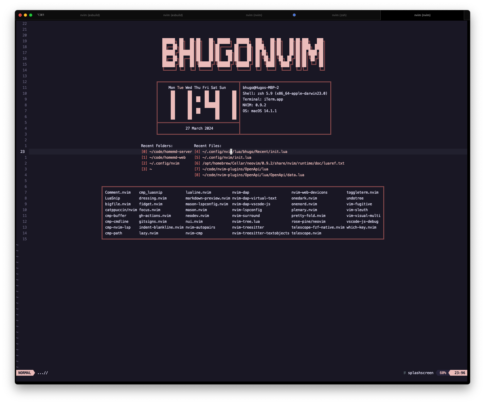

# SplashScreen
My current implementation of a splash screen

The key aspects of the implementation are:
1. create a scratch buffer
2. add text to it
3. display it on the current window on startup if vim.argc() == 0

lines.lua provides a bunch of utility functions to work with a list of lines
that allows to easily build a UI

The core of the rendering is done in the `redraw` function inside `SplashScreen/init.lua`

### Things to consider in the future
- Add more abstractions and extract into plugin
- Updating the clock in realtime
    - should be easy enough through some combination of defer_fn and redraw, 
- Ensure the widgets are multiplatform (right now it's only tested on macos)

